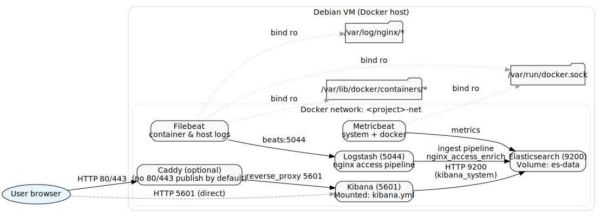

# ELK Lab on Docker with Terraform (.lab)

Spin up a **single-node Elasticsearch + Kibana + Logstash + Beats** stack on a Debian VM using Terraform and Docker.
This repo is aimed at homelab showcase projects and interview demos. It’s **Terraform-first**, renders configs locally,
and avoids leaking secrets by keeping `envs/` and `rendered/` out of Git.

> Works great on a VM that also runs k3s: Caddy is included but **does not publish 80/443 by default** to avoid port conflicts.

---

## What you get

- **Elasticsearch** (single node, security on) with a persistent Docker volume
- **Kibana** with **persistent encryption keys** (mounted `kibana.yml`)
- **Logstash** with an nginx access pipeline + geoip & user-agent enrichment
- **Filebeat** (container & host log tails → Logstash)
- **Metricbeat** (system & docker metrics → Elasticsearch)
- **Caddy** reverse proxy (optional; no ports published by default on k3s hosts)

---

## Architecture



> If you haven’t generated the image yet, run:
>
> ```bash
> # Install Graphviz if needed
> sudo apt-get install -y graphviz
> # Generate PNG/SVG from the Graphviz source
> dot -Tpng -o docs/architecture.png docs/architecture.dot
> dot -Tsvg -o docs/architecture.svg docs/architecture.dot
> ```

---

## Repo layout

```
.
├── envs/                     # local secrets & settings (ignored by Git)
│   └── local.tfvars
├── modules/
│   ├── config/               # renders configs to ./rendered/*
│   │   ├── main.tf
│   │   ├── variables.tf
│   │   └── templates/
│   │       ├── beats/{filebeat.yml,metricbeat.yml}
│   │       ├── logstash/{nginx.conf.tmpl,access-geo-useragent.json}
│   │       ├── reverse-proxy/Caddyfile.tmpl
│   │       └── kibana.yml.tmpl
│   └── docker-elk/           # docker network, images, containers
│       ├── main.tf
│       └── variables.tf
├── rendered/                 # **generated** configs mounted into containers (ignored)
├── main.tf                   # wires modules together
├── variables.tf              # root variables
├── providers.tf              # docker/local/null providers
└── outputs.tf
```

---

## Prerequisites

- Debian/Ubuntu VM with **Docker Engine** and **Terraform**
- `vm.max_map_count = 262144` on the host
- Optional: `graphviz` for generating the diagram

---

## Quickstart

1) **Create your local variables file:**

```bash
cat > envs/local.tfvars <<'EOF'
project_name = "elk-lab"
domain       = "elk.lab"
docker_host  = "unix:///var/run/docker.sock"
stack_version = "8.15.0"
es_java_opts  = "-Xms2g -Xmx2g"

elastic_password        = "ChangeMe_Elastic"
kibana_system_password  = "ChangeMe_Kibana"

# Kibana encryption keys (persist across restarts/upgrades)
kibana_security_encryption_key  = "GENERATE_ME"
kibana_eso_encryption_key       = "GENERATE_ME"
kibana_reporting_encryption_key = "GENERATE_ME"
EOF
```

2) **Initialize & render (no containers yet):**

```bash
terraform init
terraform apply -var-file=envs/local.tfvars -var deploy_containers=false
```

3) **Start the stack:**

```bash
# One-time kernel setting (if ES complains)
echo 'vm.max_map_count=262144' | sudo tee /etc/sysctl.d/99-elastic.conf && sudo sysctl --system

terraform apply -var-file=envs/local.tfvars -var deploy_containers=true
```

4) **Open Kibana:** `http://<vm-ip>:5601`  
   Login: **elastic** / your `elastic_password`.

---

## Troubleshooting

**Kibana says “server is not ready yet”**
- Reset inside ES and restart Kibana:
  ```bash
  docker exec -it <project>-es01 bin/elasticsearch-reset-password -u elastic -i
  docker exec -it <project>-es01 bin/elasticsearch-reset-password -u kibana_system -i
  docker restart <project>-kibana
  ```

**Port 80 is in use (k3s)**
- Caddy is kept but **does not publish** 80/443 by default; use `:5601` directly.

**Elasticsearch vm.max_map_count error**
```bash
echo 'vm.max_map_count=262144' | sudo tee /etc/sysctl.d/99-elastic.conf
sudo sysctl --system
```

**After changing passwords**
```bash
terraform apply -var-file=envs/local.tfvars -var deploy_containers=false
docker restart <project>-logstash <project>-metricbeat
```

---

## Security notes

- Lab stack; don’t expose 5601/9200 to the internet.
- Keep `envs/` and `rendered/` out of Git (.gitignore included).
- Prefer API keys for Beats/Logstash in real deployments.

---

## Generate the architecture diagram

```bash
sudo apt-get update && sudo apt-get install -y graphviz
dot -Tpng -o docs/architecture.png docs/architecture.dot
dot -Tsvg -o docs/architecture.svg docs/architecture.dot
```

---

## License

MIT
