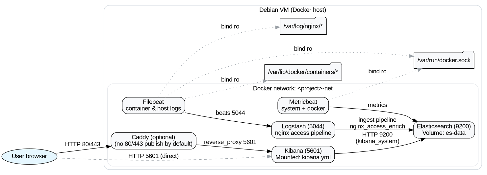

<!-- Banner -->
<h1 align="center">ELK Lab on Docker with Terraform (.lab)</h1>
<p align="center">
  <b>Single-command homelab ELK stack — Elasticsearch, Kibana, Logstash, Beats — reproducible with Terraform.</b><br/>
  <sub>Designed to run alongside k3s without fighting for ports.</sub>
</p>

<p align="center">
  
  
  
  
  
</p>

---

## TL;DR (10s)
```bash
terraform init
terraform apply -var-file=envs/local.tfvars -var deploy_containers=false  # render configs
terraform apply -var-file=envs/local.tfvars -var deploy_containers=true   # start containers
# Kibana → http://<vm-ip>:5601  (user: elastic / password from tfvars)
```

---

## What this proves about me
- **Infrastructure as Code**: Modular Terraform for Docker networking, volumes, images, and containers.
- **Secure defaults**: ES security enabled, Kibana **persistent encryption keys** via mounted `kibana.yml`.
- **Observability plumbing**: Filebeat + Metricbeat → Logstash → Elasticsearch with **ingest pipeline** (geoIP + user-agent).
- **Platform awareness**: Designed to **coexist with k3s** (no host port 80/443 bindings by default).
- **Operational hygiene**: One-shot automation script, Git-safe layout (no secrets/state committed).
- **Readable docs**: Architecture diagram (Graphviz) + Makefile targets.

> Copy-ready resume bullets:
> - Built a Terraform-driven ELK stack (Docker) with secure defaults, persistent Kibana encryption keys, and Beats → Logstash → ES ingest pipeline (geoIP/UA) for nginx access logs.  
> - Productionized developer UX with one-shot bootstrap script, Makefile, and diagrams; designed to run alongside k3s without port conflicts.

---

## Screenshots
<p align="center">
  
</p>

> Optional: add a dashboard screenshot here (e.g., `docs/kibana-dashboard.png`) to show geo map, 2xx/4xx trends, top paths, and container metrics.

---

## Architecture
- **Elasticsearch** (single node, secured) with persistent volume  
- **Kibana** with mounted `kibana.yml` (encryption keys persisted)  
- **Logstash** nginx pipeline → **ingest pipeline** (geoip/user-agent)  
- **Filebeat**: container + host logs  
- **Metricbeat**: system + docker metrics  
- **Caddy** reverse proxy (optional, no host ports published by default)

Generate the diagram:
```bash
make install-graphviz
make diagram     # builds docs/architecture.{png,svg} from docs/architecture.dot
```

---

## Repo layout
```
.
├── envs/                     # local secrets & settings (ignored)
│   └── local.tfvars
├── modules/
│   ├── config/               # renders to ./rendered/*
│   └── docker-elk/           # docker network, images, containers
├── rendered/                 # generated configs (ignored)
├── main.tf  variables.tf  providers.tf  outputs.tf
└── docs/architecture.dot     # Graphviz source
```

---

## Prereqs
- Debian/Ubuntu VM with **Docker** & **Terraform**  
- `vm.max_map_count = 262144`  
- `graphviz` (for diagram)

```bash
# One-time if ES complains about vm.max_map_count
echo 'vm.max_map_count=262144' | sudo tee /etc/sysctl.d/99-elastic.conf && sudo sysctl --system
```

---

## Quickstart
```bash
# 1) create your local vars (use strong secrets)
cat > envs/local.tfvars <<'EOF'
project_name = "elk-lab"
domain       = "elk.lab"
docker_host  = "unix:///var/run/docker.sock"
stack_version = "8.15.0"
es_java_opts  = "-Xms2g -Xmx2g"

elastic_password        = "ChangeMe_Elastic"
kibana_system_password  = "ChangeMe_Kibana"

# Kibana encryption keys (persist!)
kibana_security_encryption_key  = "GENERATE_ME"
kibana_eso_encryption_key       = "GENERATE_ME"
kibana_reporting_encryption_key = "GENERATE_ME"
EOF

# 2) init + render configs, then launch
terraform init
terraform apply -var-file=envs/local.tfvars -var deploy_containers=false
terraform apply -var-file=envs/local.tfvars -var deploy_containers=true

# 3) open kibana
# http://<vm-ip>:5601  (user: elastic / password from tfvars)
```

---

## Troubleshooting (fast)
- **Kibana “server not ready yet”** → reset passwords inside ES, then `docker restart <project>-kibana`.
- **Port 80 busy (k3s)** → Caddy has no host port mapping by default; use `:5601` directly, or remap to 8080/8443.
- **Changed passwords** → update `envs/local.tfvars`, re-render (`deploy_containers=false`), restart Logstash/Metricbeat.

---

## Make targets
```bash
make diagram            # build PNG+SVG from docs/architecture.dot
make tf-fmt             # terraform fmt -recursive
make tf-validate        # fmt + terraform validate
```

---

## Security notes
Lab stack; don’t expose 5601/9200 publicly. Keep `envs/` & `rendered/` out of Git. Prefer API keys for Beats/Logstash in prod.

---

## Roadmap
- [ ] GitHub Action: `terraform fmt` + `validate` on PRs
- [ ] Beats/Logstash → **API keys** (least-privilege)
- [ ] Sample dashboards + scripted demo traffic
- [ ] Optional k3s Ingress instead of Caddy
