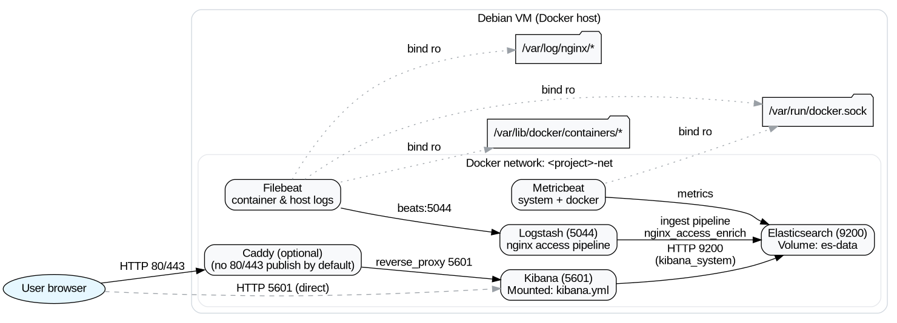

<h1 align="center">ELK Lab on Docker with Terraform (.lab)</h1>
<p align="center">
  
  
  
  
  
</p>

<p align="center"><b>Production-inspired observability lab built with Terraform, Docker, Elasticsearch, Kibana, Logstash, Filebeat, and Metricbeat.</b></p>

---

# Overview

This project demonstrates how to deploy and operate a complete ELK observability stack using Infrastructure as Code principles.

Key concepts demonstrated:

- Terraform Infrastructure as Code
- Modular Terraform design
- Docker container orchestration
- Centralized logging and ingestion
- Infrastructure monitoring with Metricbeat
- GitHub Actions CI/CD
- TFLint static analysis
- Checkov security scanning
- Docker health checks
- Architecture documentation
- Operational runbooks
- Demo log generation

---

# Project Highlights

✅ Terraform Infrastructure as Code

✅ Modular Terraform modules

✅ Elasticsearch, Kibana, Logstash, Filebeat, and Metricbeat

✅ GitHub Actions CI pipeline

✅ Terraform validation and formatting enforcement

✅ TFLint static analysis

✅ Checkov security scanning

✅ Docker container health checks

✅ Log enrichment with GeoIP and User-Agent processing

✅ Runbook-driven operations

✅ Architecture diagrams

✅ Demo data generation tooling

---

# Quick Start

```bash
cp terraform.tfvars.example terraform.tfvars

# Update passwords and environment settings
nano terraform.tfvars

terraform init
terraform plan
terraform apply
```

Access Kibana:

```text
http://<server-ip>:5601
```

---

# Architecture

<p align="center">
  
</p>

The stack consists of:

| Component | Purpose |
|------------|----------|
| Elasticsearch | Search, indexing, and storage |
| Kibana | Visualization and analytics |
| Logstash | Parsing and enrichment |
| Filebeat | Log collection |
| Metricbeat | Infrastructure metrics |
| Terraform | Infrastructure provisioning |
| Docker | Container runtime |

---

# Screenshots

## Kibana Dashboard


## Kibana Discover


## Metricbeat Host Metrics


## Container Health Monitoring


---

# CI/CD

GitHub Actions automatically validates infrastructure changes.

Validation pipeline includes:

- terraform fmt
- terraform validate
- TFLint
- Checkov security scanning

This helps prevent configuration drift and catches issues before deployment.

---

# Security

Security-focused improvements include:

- Sensitive Terraform variables
- No production secrets committed to Git
- Example tfvars template
- Checkov security scanning
- Health monitoring
- Docker network isolation

For production environments, API keys should be preferred over passwords where possible.

---

# Demo Log Generation

Generate realistic web access logs:

```bash
./scripts/generate-nginx-logs.sh
```

The generated logs can be ingested into Logstash and visualized through Kibana dashboards.

---

# Operations Runbooks

Operational documentation is provided under:

```text
docs/runbooks/troubleshooting.md
```

Covered scenarios include:

- Kibana unavailable
- Elasticsearch health issues
- Log ingestion failures
- Password rotation
- Full stack rebuild procedures

---

# Repository Layout

```text
.
├── .github/workflows/
├── docs/
│   ├── architecture.*
│   ├── runbooks/
│   └── screenshots/
├── modules/
│   ├── config/
│   └── docker-elk/
├── scripts/
├── terraform.tfvars.example
├── main.tf
├── variables.tf
└── outputs.tf
```

---

# Troubleshooting

Check container status:

```bash
docker ps
```

Check Elasticsearch health:

```bash
curl http://localhost:9200/_cluster/health
```

Check Kibana:

```bash
curl http://localhost:5601/api/status
```

Review container logs:

```bash
docker logs elasticsearch
docker logs kibana
docker logs logstash
```

---

# Cleanup

```bash
terraform destroy
```

---

# Future Enhancements

Potential future improvements:

- TLS-enabled deployment
- API-key authentication
- Kubernetes deployment option
- Elasticsearch snapshot automation
- Alerting integrations
- Grafana integration

---

Built as a portfolio project to demonstrate modern Infrastructure Engineering, Platform Engineering, and Observability practices.
